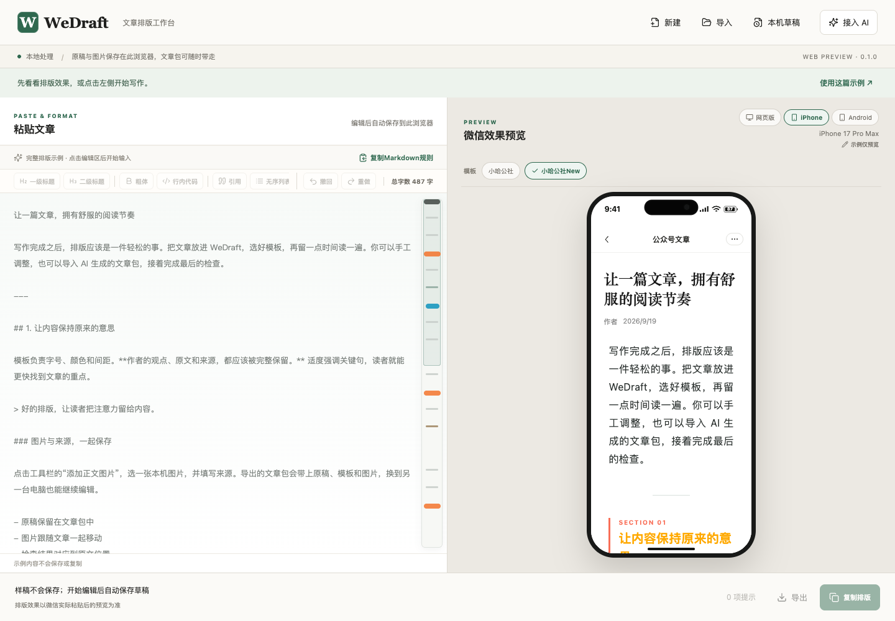
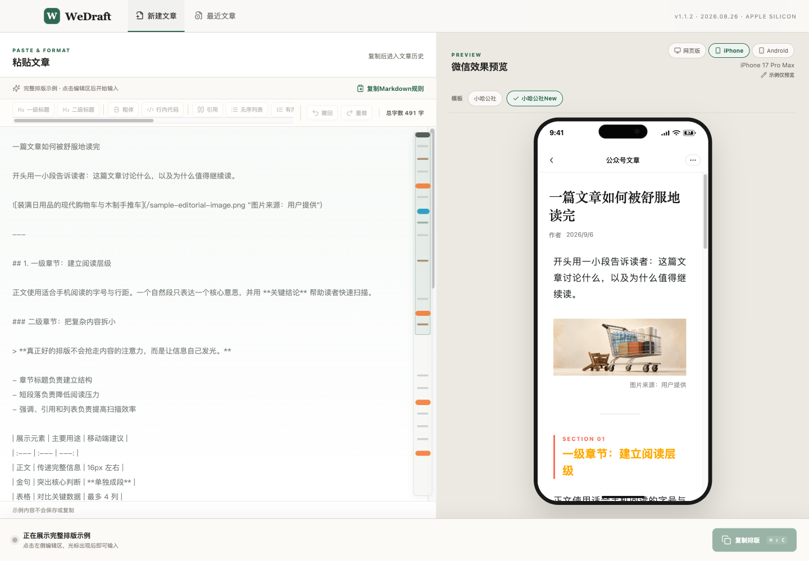

<p align="center">
  
</p>

<h1 align="center">WeDraft</h1>

<p align="center"><strong>把 Markdown 变成适合微信阅读的文章。</strong><br>在网页里边改边看，或让 AI 直接完成排版。</p>

<p align="center">
  <a href="https://wedraft.xiaoha.org">立即使用</a> ·
  <a href="https://wedraft.xiaoha.org/#/templates">浏览模板</a> ·
  <a href="https://wedraft.xiaoha.org/#/ai">接入 AI</a> ·
  <a href="LICENSE">MIT 开源</a>
</p>

<p align="center">
  <a href="https://xiaoha.org"> 小哈公社出品</a>
</p>



WeDraft 是面向微信公众号文章的 Markdown 排版工具。标题、段落、引用、列表、代码、表格、图片和来源说明，由统一模板处理；完成后复制富文本正文，粘贴到公众号后台。

网页版、CLI、MCP 和 Skill 共用排版核心，让手工编辑与 AI 工作流使用同一套效果。线上为 **0.1.0 公开测试版**，当前源码准备 **0.1.1**；实际部署以 [release.json](https://wedraft.xiaoha.org/release.json) 为准。

## 核心功能

- **边写边看，也能直接改预览。** Markdown 与排版实时联动；在预览中微调文字会写回原稿，支持双向定位、滚动、撤回和重做。
- **七款模板，一键换风格。** 切换排版不改原文，选中的模板可设为默认，下次打开继续使用。
- **在手机尺寸下检查阅读效果。** 提供网页、iPhone、Android 预览；手机外框等比缩放，保留正文排版宽度。
- **图片与来源一起排好。** 支持 PNG、JPEG、GIF、WEBP，图片说明、来源与正文统一呈现。
- **复制前检查，发现问题能定位。** 提示不支持的语法和图片、表格等问题；阻断问题修正后再复制，减少内容静默丢失。
- **原稿可带走，工作流可接续。** 导出 `.wedraft.zip`，一起保留 Markdown、模板与本地图片；重新导入网页继续编辑，也可导出独立 HTML 预览。

## 两种用法

### 在网页里完成排版

1. [打开 WeDraft](https://wedraft.xiaoha.org)，点击灰色示例区，粘贴 Markdown 或导入文件。
2. 选模板、调整文字与图片，对照预览检查效果。
3. 点击「复制排版」，到公众号后台粘贴正文，单独填写标题并检查后发布。

原稿还不是合适的 Markdown？在[接入 AI → 手工整理](https://wedraft.xiaoha.org/#/ai)复制格式指令，将指令与原文交给 AI，再把结果放回网页。无需安装工具。

### 让 AI 直接排版

把这句话交给能执行本机命令的 AI：

> 读取 https://wedraft.xiaoha.org/connect.md，帮我接入 WeDraft，然后为这篇 Markdown 文章排版。

也可以在终端执行一条命令：

```sh
curl -fsSL 'https://wedraft.xiaoha.org/integrations/install.sh' | sh -s -- 'https://wedraft.xiaoha.org/integrations/'
```

安装器准备 CLI、MCP 和 Skill，自动配置 Codex；缺少 Node 时会准备专用运行时。当前支持 macOS / Linux，其他本地 stdio MCP 客户端见[接入指南](docs/ai-integration.md)。

接入后，每篇文章只需一句话：

> 用 WeDraft 的青岚模板排版这篇 Markdown，保留原文、链接和图片来源，给我可以复制富文本的预览。

AI 会生成 `preview.html` 和文章包。打开预览，复制正文即可；需要继续修改时，把文章包导入网页。有浏览器与剪贴板能力的 AI，还可按你的指令继续完成复制、粘贴。WeDraft 本身不操作微信，也不自动发布。

## 七款阅读模板

| 模板 | 风格 |
| --- | --- |
| 小哈公社 | 经典暖色 |
| 小哈公社New | 清爽绿调，初始默认模板 |
| 素笺 | 暖灰留白 |
| 墨刊 | 黑白刊物 |
| 青岚 | 松青书页 |
| 蓝图 | 理性蓝调 |
| 朱砂 | 砖红篇章 |

[打开模板库](https://wedraft.xiaoha.org/#/templates)查看完整效果。欢迎 Fork 项目，设计自己的模板并提交 PR；合入后的模板会随版本提供给网页和 AI 工具。详见[模板贡献指南](docs/templates.md)。

## 本地处理，文件由你保管

无需注册、微信凭据或模型 API Key。WeDraft 不提供内容上传、云同步或遥测；外部图片仍会访问来源网站，使用外部 AI 时由你选择的 AI 服务处理稿件。

**网页不是文章仓库。** 文章与本地图片仅在当前页面临时保留，刷新、关闭或通过导航返回首页会重新显示示例。需要保留时，请先导出文章包；Cookie 只记住模板偏好。

手机预览是模拟视口，当前尚未完成真实微信环境验收；发布前请在公众号后台检查图片、链接与最终排版。

## macOS 应用

当前版本：`1.1.2` · 更新日期：`2026.08.26`

WeDraft 同时保留 Apple Silicon Mac 应用，支持本地图片优化、复制后的文章历史，以及单篇 Markdown / 多篇 ZIP 导出。Mac 历史与网页文章包各自独立。



*Mac 前端的浏览器预览截图，使用内置样稿。*

目前提供源码构建，没有公开 Mac 安装包；当前构建采用 ad-hoc 签名，未做 Developer ID 公证。详细操作见 [Mac 使用指南](docs/user-guide.md)。

## 本地开发

Node.js 与 pnpm 版本分别见 `.node-version` 和 `package.json`。仅运行网页或 AI 工具不需要 Rust。

```sh
git clone https://github.com/pafa/WeDraft.git
cd WeDraft
pnpm install --frozen-lockfile
pnpm dev:web
```

| 命令 | 用途 |
| --- | --- |
| `pnpm build:web` | 构建静态网页与 AI 安装资源 |
| `pnpm build:tools` | 构建 CLI 与本地 MCP |
| `node packages/cli/dist/cli.mjs --help` | 查看 CLI 用法（先构建工具） |
| `pnpm dev` | 启动 Mac 开发环境，另需 Rust 与 Xcode Command Line Tools |
| `pnpm build:mac` | 构建 Apple Silicon `.app` 与 `.dmg` |
| `./scripts/verify` | 运行仓库检查、类型检查、测试与构建 |

`main` 是最新已合入的开源主线，线上版本可能晚于源码。欢迎[报告问题](https://github.com/pafa/WeDraft/issues)、贡献模板或改进代码；提交前请阅读[贡献指南](CONTRIBUTING.md)。

[网页指南](docs/web-guide.md) · [AI / CLI / MCP](docs/ai-integration.md) · [架构](docs/architecture.md) · [部署](docs/deployment.md) · [版本记录](CHANGELOG.md) · [发布记录](docs/releases/web-0.1.0.md) · [维护规则](docs/git-workflow.md)

本项目采用 [MIT 许可证](LICENSE)。
